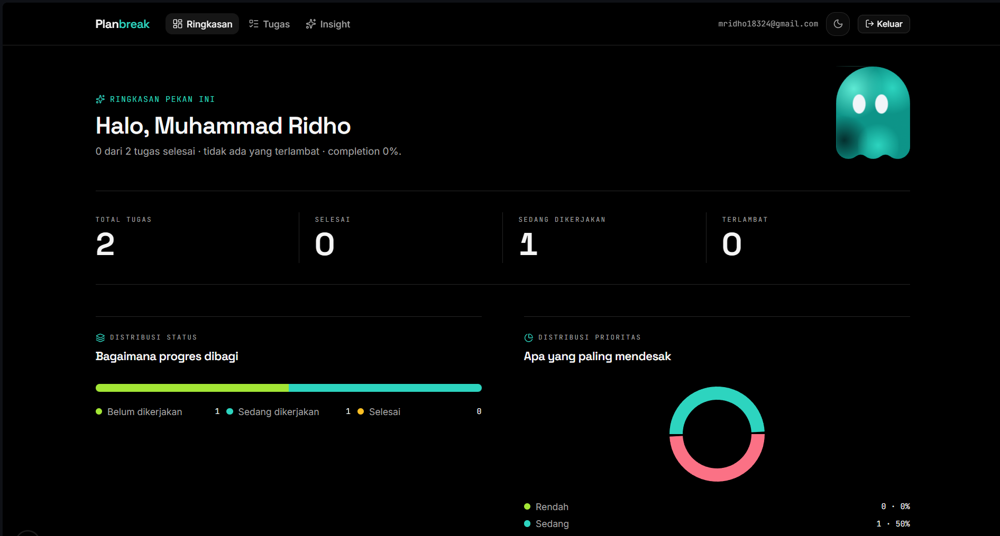

# Planbreak — AI Productivity Planner

> Break big plans into small executable steps, powered by AI.

Planbreak is a web-based task manager that uses Google Gemini to split large
tasks into manageable subtasks with time estimates, surface the most
important work through smart prioritization, and generate weekly productivity
insights.

Built with Next.js, Prisma + Supabase, and NextAuth — fully responsive and
available in light/dark mode.

---

## Features

### Authentication
- Register, login, and logout (NextAuth v5, credentials provider, bcrypt hashing)
- Password reset via email (Nodemailer + Gmail App Password)
- Protected routes via middleware
- Password strength meter on registration

### Task Management
- Full CRUD for tasks: title, description, status, priority, category, due date
- Subtasks: add, edit, delete, and reorder (drag-free up/down controls)
- Estimated duration as hours/minutes inputs
- Sorting (newest/oldest/due date/priority) and category filter
- Export current view to CSV or JSON

### Dashboard & Insights
- Completion rate, task counts, and productivity charts (Recharts)
- "Focus of the Day" panel with AI-ranked priority suggestions (top 5)
- Weekly AI insight based on the last 7 days of activity

### AI (Google Gemini)
- **AI Breakdown** — split a task into subtasks with time estimates
- **Smart Prioritization** — score and rank tasks by urgency and value
- **Natural-language task creation** — type "besok jam 9 beli bahan masakan"
  and get a structured task (title, category, priority, due date, subtasks)
- Graceful fallback when the free-tier quota is exhausted (no crashes)

---

## Tech Stack

| Layer        | Technology                                                        |
| ------------ | ----------------------------------------------------------------- |
| Framework    | Next.js 16 (App Router) + TypeScript (strict)                     |
| Styling      | TailwindCSS v4 + shadcn/ui + Radix UI                             |
| Database     | Supabase (PostgreSQL) via Prisma 7 + `@prisma/adapter-pg`          |
| Auth         | NextAuth v5 (JWT + session) + bcryptjs                            |
| AI           | Google Gemini (`@google/genai`, `gemini-flash-latest`)            |
| Charts       | Recharts                                                          |
| Extras       | date-fns, Zod, Nodemailer, Sonner, next-themes, Motion            |

---

## Getting Started

### Prerequisites
- Node.js 20+ and npm
- A [Supabase](https://supabase.com) project (Postgres)
- A Google Gemini API key from [AI Studio](https://aistudio.google.com/apikey)
- A Gmail account with an [App Password](https://myaccount.google.com/apppasswords)
  (only needed for password-reset email)

### Local Setup

1. Install dependencies:
   ```bash
   npm install
   ```

2. Create your environment file and fill in the values:
   ```bash
   cp .env.example .env.local
   ```

3. Set up the database schema and seed demo data:
   ```bash
   npx prisma migrate dev
   npm run db:seed
   ```

4. Start the development server:
   ```bash
   npm run dev
   ```

5. Open [http://localhost:3000](http://localhost:3000).

### Demo Account
| Email               | Password  |
| ------------------- | --------- |
| `demo@example.com`  | `demo1234`|

---

## Environment Variables

See `.env.example` for the full list with comments.

| Variable              | Description                                                     |
| --------------------- | --------------------------------------------------------------- |
| `DATABASE_URL`        | Supabase Postgres connection string (Session Pooler, port 5432) |
| `AUTH_SECRET`         | NextAuth v5 secret for JWT signing (32-byte hex recommended)    |
| `GEMINI_API_KEY`      | Google Gemini API key (AI features)                             |
| `APP_URL`             | App base URL, used to build links in emails                      |
| `GMAIL_USER`          | Gmail address for sending reset-password emails                 |
| `GMAIL_APP_PASSWORD`  | Gmail App Password (requires 2-Step Verification)               |

---

## Scripts

| Command            | Description                              |
| ------------------ | ---------------------------------------- |
| `npm run dev`      | Start the development server             |
| `npm run build`    | Production build                         |
| `npm start`        | Start the production server              |
| `npm run lint`     | Run ESLint                               |
| `npm run db:generate` | Regenerate the Prisma client         |
| `npm run db:migrate`  | Run a Prisma migration               |
| `npm run db:seed`     | Seed the database with demo data    |

---

## AI Notes

- The app uses the `gemini-flash-latest` model. `gemini-2.0-flash` and
  `gemini-2.5-flash` are no longer available to new API keys.
- Free-tier Gemini has rate limits. When the quota is exhausted, the app
  shows a friendly fallback message instead of crashing.
- All AI responses are validated and sanitized on the server before being
  stored.

---

## Screenshots



---

## Repository Structure

```
ai-productivity-planner/
├── app/
│   ├── (auth)/login, register        # auth pages
│   ├── (dashboard)/                  # dashboard, tasks, insights
│   ├── api/                          # tasks, tasks/[id], ai/breakdown,
│   │                                 # ai/insight, ai/prioritize, ai/parse-task
│   └── layout.tsx
├── components/                       # UI, forms, charts
├── lib/                              # prisma, ai (Gemini client), actions, utils
└── prisma/                           # schema, seed
```

---

## Roadmap / Status

**Done**
- [x] Setup (Next.js, Tailwind, shadcn/ui, Prisma + Supabase, seed)
- [x] Auth (register/login/logout, reset password, route protection)
- [x] Task CRUD + subtasks + dashboard charts + export
- [x] AI breakdown, weekly insight, smart prioritization, natural-language input
- [x] Dark mode, responsive layout, overdue badges

**Planned**
- [ ] Unit tests (Vitest) for AI splitting & helper logic
- [ ] GitHub Actions CI (lint + test + typecheck)

---

## License

Personal project — for private use. All rights reserved.
